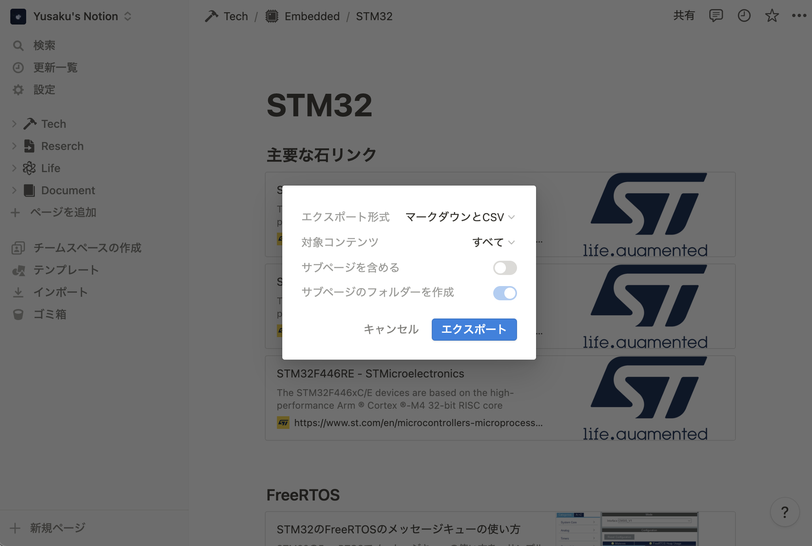
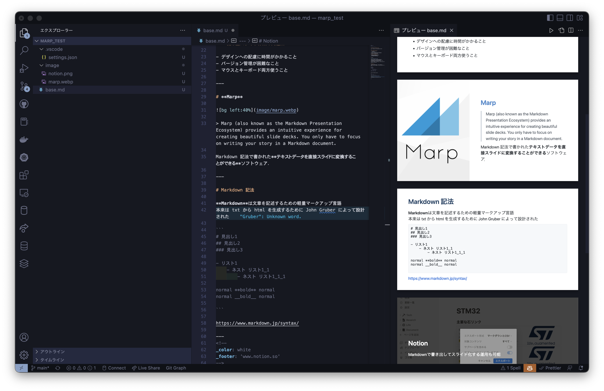
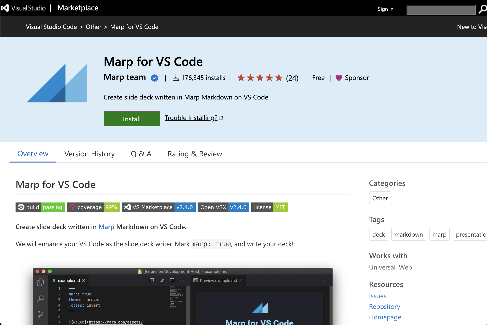
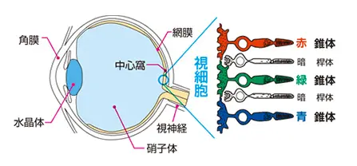
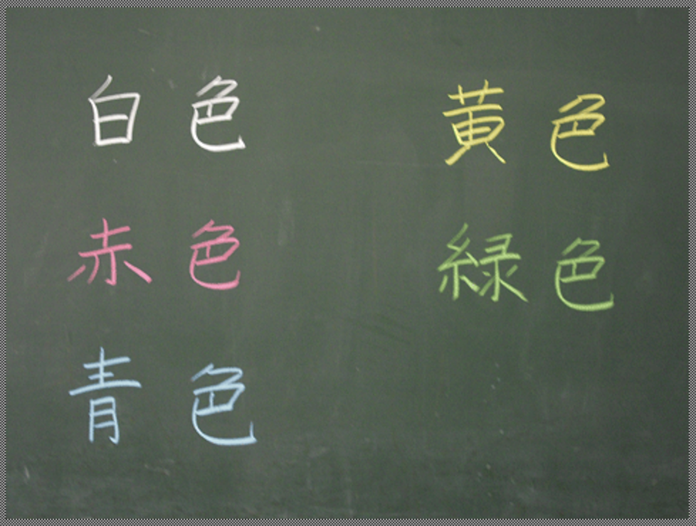
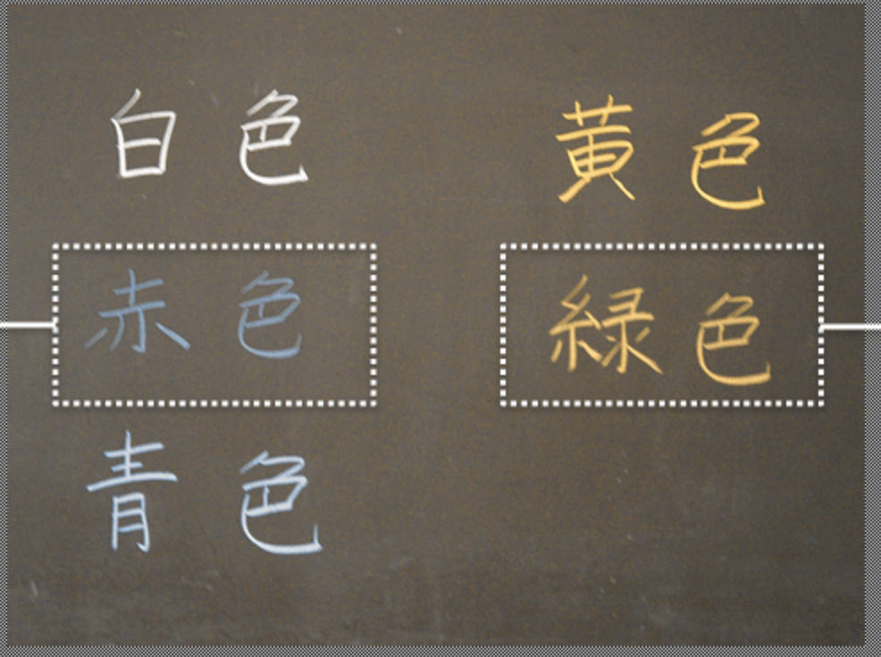
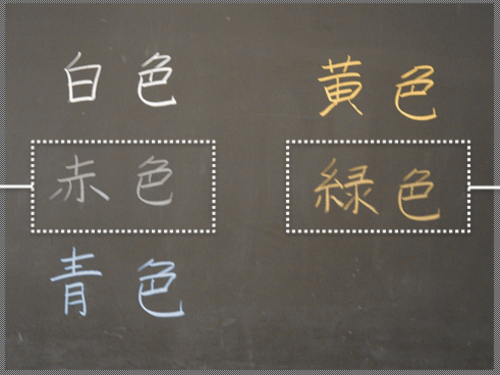
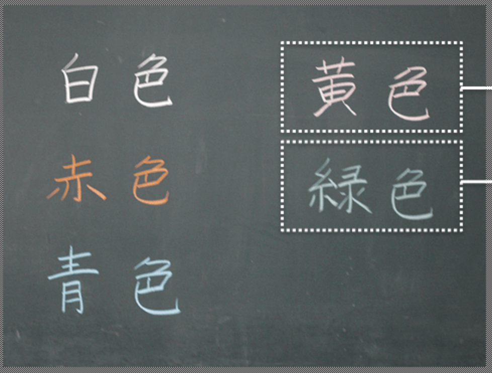
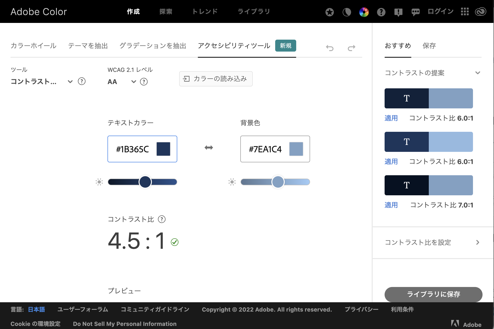
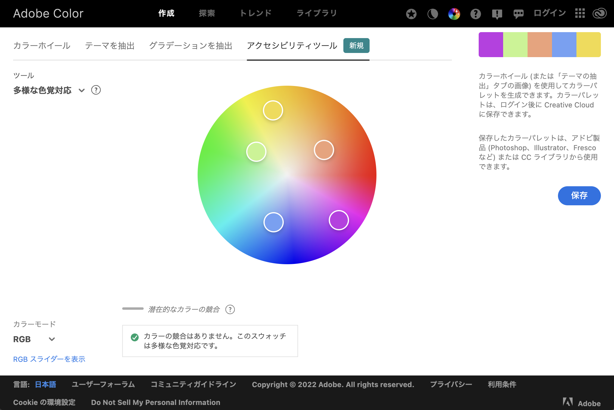

<!--
_class: invert
_footer: '2022年12月26日（月）@拾壱・ビッグストーン株式会社 総合技術研究会'
-->

# Marp によるプレゼンテーション作成

バージョン管理可能なスライドを高速作成するノウハウ

---

<!--
_color: white
-->

# お気持ち表明


ぼっちざろっくが終わりましたね
水星の魔女がいい感じにガンダム感出てきたので
ぼざろロスな人は水星ちゃんみましょう．

---

# 業務中におけるスライド作成

- 補助金の申請資料
- 顧客への簡易的な説明資料

なんといっても作成するのがそこそこ**面倒くさい**
→ なんとかなんとか時短できないか

### 従来型スライド作成の問題点

- デザインへの配慮に時間がかかること
- バージョン管理が困難なこと
- マウスとキーボード両方使うこと

---

# **Marp**


> Marp (also known as the Markdown Presentation Ecosystem) provides an intuitive experience for creating beautiful slide decks. You only have to focus on writing your story in a Markdown document.

Markdown 記法で書かれた**テキストデータを直接スライドに変換することができる**ソフトウェア．
株式会社 Speee 服部雄輝氏が開発．

---

# Markdown 記法

**Markdown**は文章を記述するための軽量マークアップ言語
本来は txt から html を生成するために John Gruber によって設計された

```
# 見出し1
## 見出し2
### 見出し3

- リスト1
    - ネスト リスト1_1
        - ネスト リスト1_1_1

normal **bold** normal
normal __bold__ normal

```

https://www.markdown.jp/syntax/

---

<!--
_color: white
_footer: 'www.notion.so'
-->



# Notion

Markdown で書き出してスライド化する運用も可能

---

# Marp の強さ

スライドを作るのにキーボードしか使っていない
実体はただの`.md`ファイルなので，GitHub によるバージョン管理が可能


---



---

# バージョン管理

例えばこんなふうに文章が追加されたとする

---

# marp の自在性

```rust
    struct Foo {
        x: i32,
    }

    fn do_something(f: Foo) {
        println!("{}", f.x);
        // f はここでドロップ
    }

    fn main() {
        let foo = Foo { x: 42 };
        // foo の所有権は do_something に移動
        do_something(foo);
        // foo は使えなくなる
    }
```

---

<!-- _color: white -->

``


---

``


$
    I_{xx}=\int\int_Ry^2f(x,y)\cdot{}dydx
$

---

``
``


---

<!-- _class: invert -->

# **まとめ**

Marp 良いぞ

---

# Part 2

## ノンデザイナーズ・デザイン

---

# ユニバーサルデザイン

1980 年代にアメリカの Ronald Mace が提唱

> 文化・言語・国籍や年齢・性別・能力などの違いにかかわらず、出来るだけ多くの人が利用できることを目指した建築（設備）・製品・情報などの設計

### 「デザイナー」の仕事

いろんなデザインをするクリエイティブな職業．
一般にはプロモーションや UI/UX 設計等のイメージが強い

視覚に関する幅広い知識とセンスが必要．
→ **デザイナーでなくても気を付けられることはないのか？**

---

<!-- _class: invert -->

# カラーユニバーサルデザイン（CUD）

先天性の色覚異常は日本人男性の５パーセント、女性の 0.2 パーセントの頻度で発生
**→ どんな人が扱っても事故なく安全に使用できる設計が必要**

---

# 色覚障がいの種類と見え方

<!-- _footer: 'www.asobou.co.jp/blog/web/cud' -->

人間の目の網膜には，赤、緑、青を感じる 3 種類の錐体細胞がある
うちどれかの機能が損なわると、正常に色を捉えることができなくなる


---

<!--
_color: white
_footer: 'www.toyoink1050plus.com/sustainability/ucd/virtual'
-->



---

<!--
_color: white
_footer: 'www.toyoink1050plus.com/sustainability/ucd/virtual'
-->



# 1(P)型 2 色覚

赤色を感じる「L 錐体」が正常に機能しないことにより発生
先天性色覚障がいの約 25％を占める

---

<!--
_color: white
_footer: 'www.toyoink1050plus.com/sustainability/ucd/virtual'
-->



# 2(D)型 2 色覚

緑色を感じる「M 錐体」が正常に機能しないことにより発生
先天性色覚障がいの約 75％を占め、最も多い

---

<!--
_color: white
_footer: 'www.toyoink1050plus.com/sustainability/ucd/virtual'
-->



# 3(T)型 2 色覚

青色を感じる「S 錐体」が正常に機能しないことにより発生

---

# 「色」を基準とした設計の危険性

---

# JIS X 8341-3:2016

> 1.4.1 色の仕様の達成基準（レベル A）
> 色が,情報を伝える,動作を示す,反応を促す,又は視覚的な要素を判別するための唯一の視覚的手段になっていない。

色の違いだけに頼らず、文字や形・パターンなどでも理解できるように配慮

### コントラスト比

> 1.4.3 コントラスト（最低限レベル）の達成基準（レベル AA）
> テキスト及び文字画像の視覚的提示には，少なくとも 4.5:1 のコントラスト比がある。サイズの大きなテキスト及びサイズの大きな文字画像には、少なくとも 3:1 のコントラスト比がある。

---

<!--
_footer: 'www.asobou.co.jp/blog/web/cud'
-->

# コントラスト比

明るい方の相対輝度$L_1$，暗い方の相対輝度$L_2$とすると
$(L1 + 0.05) / (L2 + 0.05)$で示される値

例えば白と黒ならば，白=1，黒=0 であるから
$(1 + 0.05) / (0 + 0.05) = 21$

### Web Content Accessibility Guidelines によれば

テキストには、少なくとも 4.5:1 のコントラスト比が必要とされる


---

<!--
_color: white
-->

# Adobe Color



---

<!--
_color: white
-->

# Adobe Color

カラーピッカーで色を選ぶと
色覚的に問題ないか判断してくれる


---

# まとめ

カラーユニバーサル設計は，ツールを使用すればどんな時でも配慮可能です
また，デザイナーに発注する際，「Web Content Accessibility Guidelines AAA 準拠で設計願います」等の
発注ができるようになります．

やってみてね
